# ReceiptCollecter

An offline Android expense tracker in **Arabic and English**. Record itemized receipts and everyday payments such as rent and subscriptions, explore spending reports, and compare item prices across purchase dates.

## Download and install

**[Download the latest Android APK](https://github.com/MohamedSamehMohamed/ReceiptCollecter/releases/latest/download/receipt-collecter.apk)**

1. Open the link on your Android phone.
2. Download `receipt-collecter.apk` and open it.
3. If Android asks, allow installation from the browser or file manager you used.
4. Tap **Install** for a first installation, or **Update** if the app is already installed.

Keep this link: future releases will use the same APK filename. No USB cable is needed.

Install updates over the existing app to preserve your data. **Do not uninstall first.** Uninstalling or clearing app storage deletes local data.

[Release notes and downloadable files](https://github.com/MohamedSamehMohamed/ReceiptCollecter/releases)

## Features

- **Offline receipt scanning:** camera/gallery, crop/rotate, bundled Arabic/English OCR and editable review. Correct missed or misread items; saving requires confirmation and matching totals. Phone runtime verification is pending.
- **Itemized receipts:** store, buyer, date, notes, categories, quantities, unit prices, and discounts.
- **Quick expenses:** record rent, subscriptions, and other payments with an amount and category; optionally add a description, payee, and notes.
- **Price history:** compare recorded unit prices for the same item across purchase dates and open the related receipts. Prices are shown before discounts.
- **Insights:** spending totals and breakdowns by category, buyer, store/payee, and month, with date filters.
- **JSON import/export:** review imports before confirming and transfer active expenses between installations.
- **Name suggestions:** reuse saved store and item names while entering receipts.
- **Arabic and English**, right-to-left layouts, light/dark themes, and system text scaling.
- **Offline storage:** data stays in the app's local SQLite database. Current expense entry and portable files use EGP.

## Screenshots

See the version-specific galleries below. These are app renders using fictional sample expenses. Screenshots are preserved per version rather than replaced by future updates.

## Version history

From version 1.5.0 onward, every update is published as a new release while previous releases remain available. **1.6.0** is the latest release; 1.5.0 and 1.4.1 are preserved. The 1.0.0 and 1.1.0 original builds are also available as historical archives.

| Version | Download | Changes |
| --- | --- | --- |
| 1.6.0 | [APK](https://github.com/MohamedSamehMohamed/ReceiptCollecter/releases/download/v1.6.0/receipt-collecter.apk) | [Release notes](https://github.com/MohamedSamehMohamed/ReceiptCollecter/releases/tag/v1.6.0) |
| 1.5.0 | [APK](https://github.com/MohamedSamehMohamed/ReceiptCollecter/releases/download/v1.5.0/receipt-collecter.apk) | [Release notes](https://github.com/MohamedSamehMohamed/ReceiptCollecter/releases/tag/v1.5.0) |
| 1.4.1 | [APK](https://github.com/MohamedSamehMohamed/ReceiptCollecter/releases/download/v1.4.1/receipt-collecter.apk) | [Release notes](https://github.com/MohamedSamehMohamed/ReceiptCollecter/releases/tag/v1.4.1) |
| 1.1.0 | [APK](https://github.com/MohamedSamehMohamed/ReceiptCollecter/releases/download/v1.1.0/receipt-collecter-1.1.0.apk) | [Release notes](https://github.com/MohamedSamehMohamed/ReceiptCollecter/releases/tag/v1.1.0) |
| 1.0.0 | [APK](https://github.com/MohamedSamehMohamed/ReceiptCollecter/releases/download/v1.0.0/receipt-collecter-1.0.0.apk) | [Release notes](https://github.com/MohamedSamehMohamed/ReceiptCollecter/releases/tag/v1.0.0) |


### 1.6.0 — Offline receipt scanning

- Added **Add → Scan receipt** with camera/gallery selection and crop/rotation.
- Bundled Arabic and English OCR models: no account, internet or API key required.
- Added photo/raw-text review and editable receipt fields. OCR can miss or misread
  items; review remains mandatory. Cash and gross totals are not automatically
  substituted for the payable total.
- Saving requires explicit review confirmation and exact agreement between the
  entered payable total and item totals including discounts. Editing clears the
  confirmation. Existing receipt storage, price history and JSON format remain.
- Receipt photos are temporary review images, not saved image attachments.
- [Usage and accuracy notes](offline-scanning.md).

#### 1.6.0 app screenshots

Fictional sample receipt; rendered from the actual Flutter screens.

| Scan receipt | Review before saving | Arabic review |
| --- | --- | --- |
| 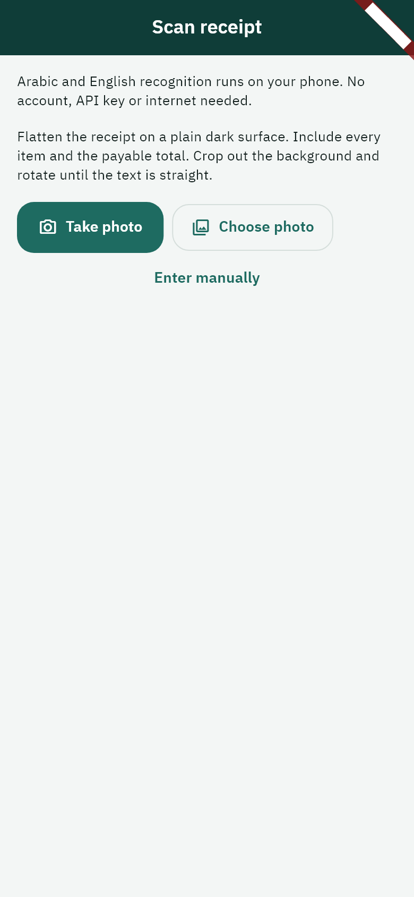 | 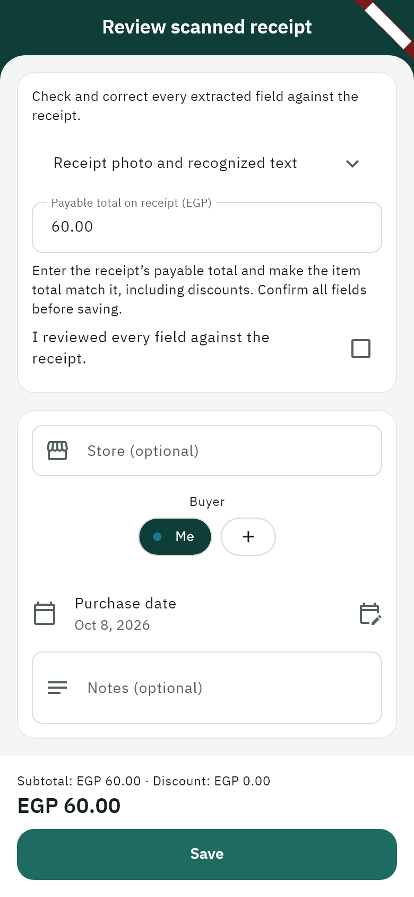 | 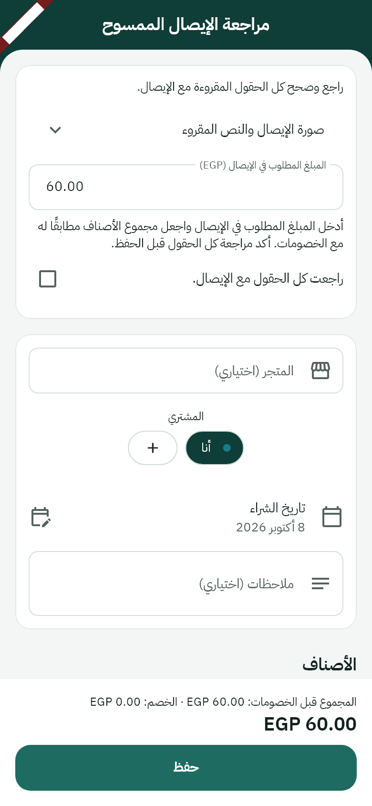 |

### 1.5.0 — Complete UI redesign

- Bundled IBM Plex Sans Arabic and centralized light/dark design tokens.
- Added four navigation destinations around a raised center + button and a new Add sheet with safe repeat actions.
- Redesigned Overview with month selection, category mix and recent expenses.
- Added searchable expense lists with type/default-buyer filters and daily groups.
- Added buyer chips, inline buyer creation, a quick-expense category grid, and sticky save controls.
- Redesigned Insights with monthly bars, breakdown tabs and a buyer/category grid.
- Redesigned Price history with item chips, ranges, purchase bars and receipt links.
- Added persistent System/Light/Dark selection in Settings and separate Categories, Buyers, and Stores/payees management pages.
- Preserved the database schema and JSON formats. Scan review remains deferred.
- Validation: clean Flutter analysis, all 53 tests passed, and Arabic/English light/dark previews at 1.3× text.

#### 1.5.0 screenshots

| Overview and month selection | Searchable Expenses | Insights and spending graph |
| --- | --- | --- |
| 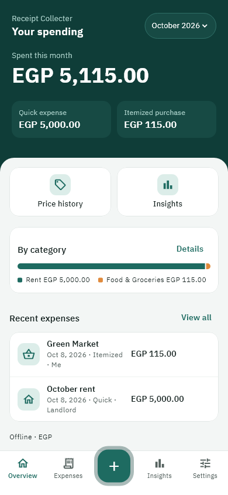 | 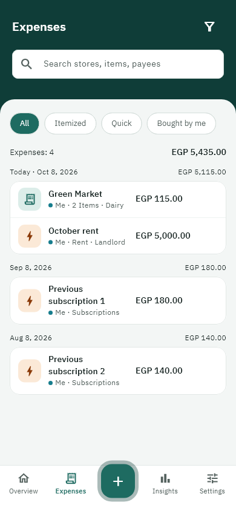 | 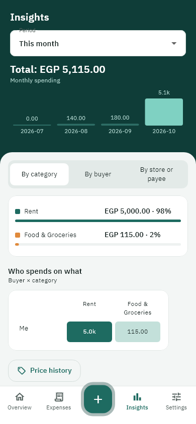 |

| Itemized receipt and discounts | Quick expense category grid | Item price history |
| --- | --- | --- |
| 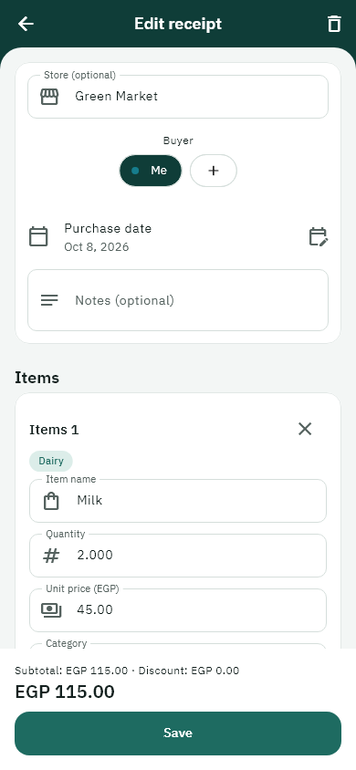 | 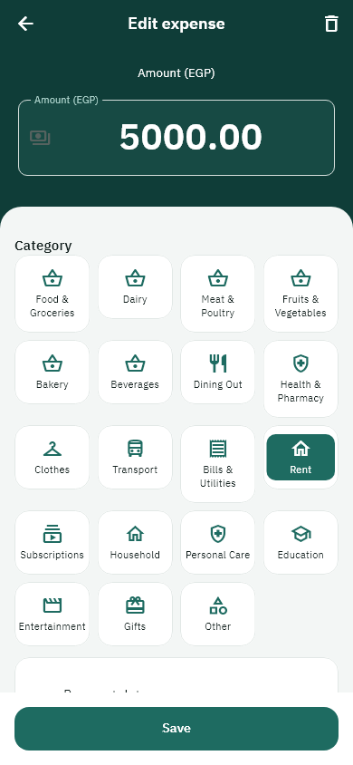 | 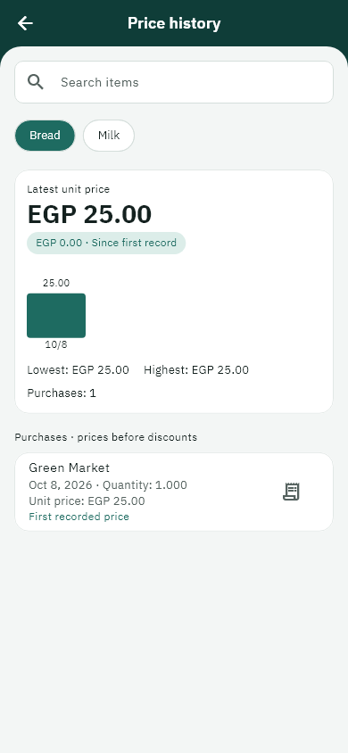 |

| Add sheet and repeat actions | Settings and theme selection | Arabic Overview |
| --- | --- | --- |
| 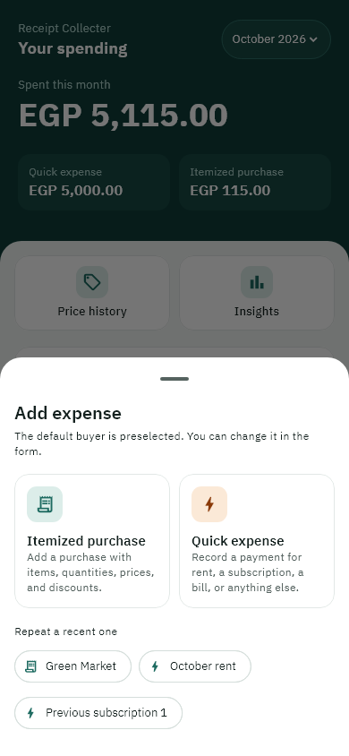 | 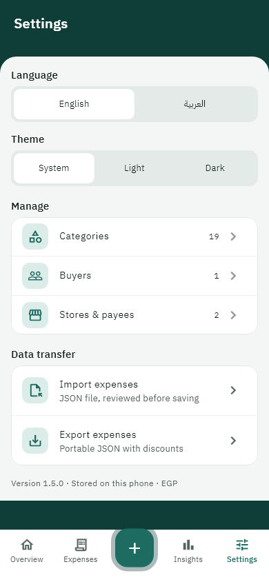 | 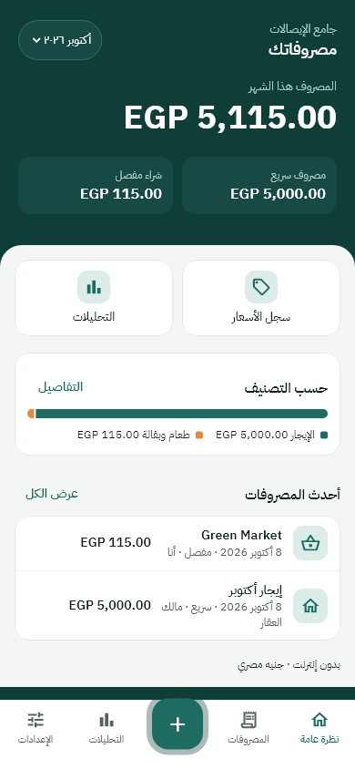 |

<details>
<summary>Version 1.5.0 dark mode</summary>

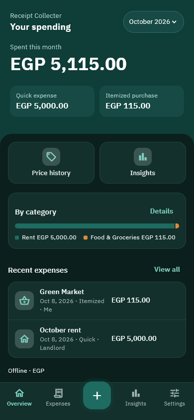

</details>

### 1.4.1 — More expenses per screen

- Reduced default font sizes and shortened the monthly summary card.
- Tightened expense rows, spacing, app bar, and bottom navigation.
- Phone previews at 390 × 844 show four expenses without scrolling in both English and Arabic.
- Preserved system text scaling and the existing database.
- Validation: clean Flutter analysis and all 43 tests passed.

#### 1.4.1 screenshots

These preserved screenshots show the previous interface before the 1.5.0 redesign.

| Compact Overview | Monthly spending graph | Arabic Overview |
| --- | --- | --- |
|  |  |  |

### 1.4.0 — Teal interface and icons

- Introduced a teal theme inspired by the Income & Expense Tracker App Figma community design.
- Added a gradient header, rounded content panels, category icons, and clearer navigation and form icons.
- Split monthly spending into quick expenses and itemized purchases.
- Added a monthly spending trend chart while retaining exact amounts as text.
- Adapted the reference to the app's existing features, with Arabic, dark mode, and large-text support.

### 1.3.0 — Everyday payments and price comparisons

- Added quick expenses for payments such as rent and subscriptions.
- Combined quick payments and receipts in the expense list, Overview, and Insights.
- Added Rent and Subscriptions categories.
- Included item price history with search, dated unit-price observations, price changes, and receipt links.
- Added portable JSON format v2 for mixed quick expenses and itemized purchases; legacy v1 receipt files remain supported.
- Quick expenses are excluded from item price history and item-name suggestions.
- Included an example import template and a Markdown guide for converting receipts into import-ready JSON.

### 1.2.0 — Faster receipt entry

- Added saved-name autocomplete for stores and receipt items.
- Supported Arabic and English matching and removed duplicate suggestions.
- Continued to allow new names; choosing a suggestion fills only the name.
- Required no database schema change.

### 1.1.0 — JSON transfer and discounts

- Added receipt import/export through Settings.
- Added an import preview and confirmation before saving.
- Supported fixed discounts per line and percentage discounts.
- Updated reports to use totals after discounts.
- Added a database migration that preserves existing receipt amounts.

### 1.0.0 — Initial app

- Added manual receipts with categorized items, quantities, and prices.
- Added receipt editing and confirmed deletion.
- Added category, buyer, and store management.
- Added this month's Overview and date-filtered spending Insights.
- Added Arabic/English localization and local SQLite storage.

Historical screenshots for versions 1.0.0–1.4.0 were not captured. Their changes are documented above; the current galleries illustrate the features retained in 1.5.0.

## Import files

Use the app's **Settings → Import expenses** to select a JSON file, review its contents, and confirm the import. **Export expenses** saves active expenses with their reference names and discounts.

Existing IDs are skipped rather than overwritten. JSON export is an expense transfer format, not a complete database backup. Apps older than 1.3.0 cannot import v2 files containing quick expenses.

The local project includes:
- `examples/expenses.template.json`: an editable example with rent, a subscription, and an itemized purchase.
- `examples/receipt-to-json-guide.md`: instructions you can give another model along with receipt images to generate the JSON.

## Development

This GitHub repository currently hosts the README, app screenshots, and APK releases. The Flutter source project is maintained locally; the automatically generated “Source code” release archives contain the repository files, not the complete app source.

With Flutter and the Android SDK installed, run these commands in the source project:

```powershell
flutter pub get
dart run build_runner build
flutter gen-l10n
flutter analyze
flutter test
flutter run
flutter build apk --release
```

On the development machine, local tooling is used by:

```powershell
./scripts/check.ps1
./scripts/build-apk.ps1
```

The current APK uses a development signing key. Published APK updates must keep the same application ID and signing key to install over existing versions.

## Release documentation policy

For every future release, add a new version section describing what it introduces, preserves, and supports; include screenshots from that build with version-specific filenames; link its release page and APK; and retain existing release notes and screenshot assets.

## Design reference

The 1.4 interface is a visual adaptation of the [Income & Expense Tracker App community Figma design](https://www.figma.com/design/xW78PRQ3IG3bFBGRHY9SRX/Income---Expense-Tracker-App--Community-?node-id=0-1). Exact Figma assets and tokens were not extracted; icons use the app's native icon set.
